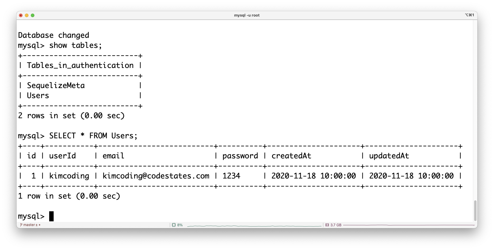

# Session Sprint Revew
이번에 진행한 세션 스프린트를 진행하면서 새로 공부한 내용들을 정리해보자.

## Server

### Server/index.js

6번 라인을 살펴보면 세션에 쿠키 정보를 담는 코드가 있다. 쿠키에는 이처럼 domain, path, maxAge, sameSite, httpOnly, secure값이 담겨진다. 
22번 라인에는 cors 정보가 담겨있다. 자세한 정보는 [공식문서](https://expressjs.com/en/resources/middleware/cors.html)를 통해 확인하자.

### Server/models/user.js

Sequelize-cli를 사용해 user 테이블의 필드값을 설정해줬다. 이를 마이그레이션 해줘서 실제 데이터베이스에 테이블을 생성하게 된다. 

생성된 Users 테이블

### Server/controller/users/login.js

8번라인에서 findOne 메소드를 사용해 입력한 유저정보와 일치하는 데이터가 존재하는지 찾고  
만약 그런 테이터가 없으면 404 상태코드를, 데이터가 존재하면 **세션에 유저정보를 담고(16번 라인)** 200상태코드와 함께 'ok'메시지를 응답에 보내준다.

### Server/controller/users/logout.js

로그아웃 방법에는 쿠키를 삭제하거나 서버를 재시작 하는 방법이 있다. 이 중, 세션에 담긴 유저 정보를 삭제하는 과정(13번 라인)을 통해 구현했다. 

### Server/controller/users/userinfo.js

로그인 시 유저정보를 불러오는 로직이다. 상태코드 200과 함께 data에 찾은 유저정보를 담아 함께 전송했다.

## Client
### Client/app.js

지금까지 익혀왔던 함수형 리액트 컴포넌트가 아니라 당황했지만, 레거시코드는 어디가도 존재할 수 있으므로 익힐 수 있는 좋은 기회였다.
constructor로 props에 state를 담아주는 작업(7번 라인)을 통해 로그인 상태(isLogin)와 유저정보(userData)를 상태에 담아줬다.

### Client/src/Components/Login.js

로그인 컴포넌트에선 중요한 두 가지 로직이 있다. 첫 번째 로그인 상태값을 담아주는 로직(5번 라인), 두 번째 입력된 유저정보가 서버에(정확하게는 DB에) 담겼는지 확인하는 과정을 통해 로그인 과정(19번라인 loginRequestHandler함수)을 구현하는 과정이다.  
아무래도 클래스형 컴포넌트가 익숙하지 않아 this 사용이 어색했는데, 함수형과 크게 다르지 않아서 금방 익혔다.
서버에 요청을 보낼 때 `{ withCredentials: true }`을 요청 헤드에 담아서 같이 보내야하는데 이 과정을 통해 Cross-domain 간의 요청과 응답이 허용된다.
27번 라인에 return 으로 Get요청을 처리했는데, 데이터체이닝 과정상 return 이 꼭 필요하다고 페어분이 설명해주셨는데, 아무리 찾아봐도 관련 내용을 못찾았다. 주말에 시간내서 더 찾아보자.

### Client/src/Components/Mypage.js

마이페이지 컴포넌트는 로그인 했을 때, 유저네임과 이메일 정보를 출력해야하는데, 로그인 했을 때 userData에 유저정보들이 담겨있어야 출력이 가능해진다. 
로그아웃 버튼클릭 이벤트 함수로 handleLogout함수가 주어지는데, 서버쪽 logout 로직이 담겨있는 앤드포인트로 post요청을 보내 두 번째 인자로 null 값을 전달해 담겨있는 유저 정보를 삭제하는걸 구현했다. 요청이 성공했으면 logoutHandler함수가 실행돼 로그인 상태가 false로 바뀌게 된다.

### 후기
크게 어렵진 않았다. 그치만 중요한? 꼭 알아두어야 할 내용들이 워낙 방대하다보니 분량이 상당했다. 아직도 개념적으로 혼동되는 부분들은 꼭 복습해두자.
특히 세션 인증 과정은 지금도 JWT보다 더 범용적으로 사용되고 있으니, 확실하게 알아두지 않으면 안된다 생각하고 반드시 숙지해두자.
