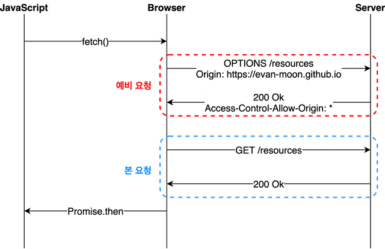
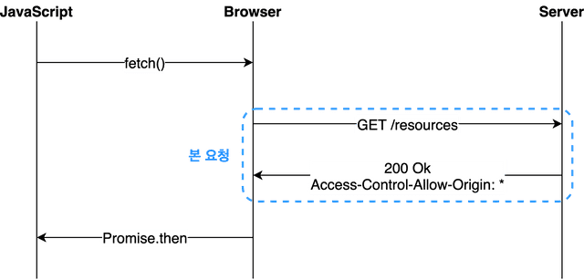

# SSR & CSR

화면에 그려지는 것(Rendering)은 HTML인데 이것을 누가 하느냐 주체에 따라 SSR과 CSR로 나뉘게 된다. 

**SSR(Server Side Rendering)**은 웹사이트가 서버에서 렌더링 되는것을 말한다. 서버에서 미리 렌더링을 마친 후에 클라이언트로 보내주기 때문에 **초기 렌더링 시간을 단축할 수 있다**. 그리고 껍데기 index.html 이 오는 것이 아닌 속이 꽉찬 녀석이 오기 때문에 **SEO에도 유리하다**. 더 빠른 첫 로딩을 제공할 수 있지만, 페이지간의 이동에서 모든것을 매번 다운로드 해야한다. 

반면 **CSR(Client Side Rendering)**은 클라이언트에서 페이지를 랜더링하는 것을 말한다. 사용자가 웹사이트에 접속하면 HTML, CSS, JS파일을 내려받고 클라이언트(브라우저)는 JS를 해석해서 렌더링 한다.   

CSR은 서버의 의존도 없이 클라이언트 자체로 렌더링 가능하므로 **빠른 화면 전환**이나 **인터렉션**이 가능한 반면, 초기 다운로드와 추가 렌더링 할 때 딜레이가 생기게 되고 **SEO에 취약하다**는 단점이 있다.

두 방식 중 어느 것을 사용할지 고려해야 할 점은 

> - [SEO(Search Engine Optimization)](https://en.wikipedia.org/wiki/Search_engine_optimization) 가 우선순위인 경우, 일반적으로 SSR(Server Side Rendering) 을 사용합니다.
> - 웹 페이지의 첫 화면 렌더링이 빠르게 필요한 경우에도, 단일 파일의 용량이 작은 SSR 이 적합합니다.
> - 웹 페이지가 사용자와 상호작용이 적은 경우, SSR 을 활용할 수 있습니다.
>
> - SEO 가 우선순위가 아닌 경우, CSR을 이용할 수 있습니다.
> - 사이트에 풍부한 상호 작용이 있는 경우, CSR 은 빠른 라우팅으로 강력한 사용자 경험을 제공합니다.
> - 웹 애플리케이션을 제작하는 경우, CSR을 이용해 더 나은 사용자 경험(빠른 동적 렌더링 등)을 제공할 수 있습니다.

# [CORS(Cross-Origin Resource Sharing)](https://developer.mozilla.org/ko/docs/Web/HTTP/CORS)

교차 출처 리소스 공유(Cross-Origin Resource Sharing, 이하 CORS)는 이름 그대로 서로 다른 origin간의 교류를 말한다. 

request에 origin의 header와 response의 header가 같으면, 같은 출처라고 브라우저는 인식을 한다. 

#### Preflight Request

1. preflight(예비요청)는 자바스크립트에 fetch로 resource를 요청하면, OPTIONS method를 통해서 예비요청을 보내게 된다. 본 요청을 보낸다.
2. header에 request origin을 보내게 된다. server는 header 중에서 ACAO을 응답하게 된다.
   : Origin에 대한 정보 뿐만 아니라 자신이 예비요청이후 보낼, 본 요청에 대한 다른 정보들도 같이 포함되어있다. (for example: Access-Control-Request-Handlers(본 request에 들어갈 header), Access-Control-Request-Method(본 request에 대한 method)등)
3. browser에서
   if > 둘이 같다면 same origin으로 보기 때문에 SOP에서 request를 보내, request를 허가를 내어준다. server-side 영역이 아닌, browser 여역이기 때문에, server는 200 status code를 반환한다.
   if > 둘이 같지 않다면, SOP이 '안전하지 않아!'라고 인식해, 허가를 막아 response를 보낼 수 없게 된다.

#### Simple Request

위의 Preflight 와 다른점은 예비 요청이 없고, 예비 요청이 했던 행동을 본 요청에서 모두 다 하는 것이다. 이부분 때고는 Preflight와 과정이 같다. Origin과 ACAO를 비교해 같으면 response를 보내고, 아니면 보내지 않는다.

Simple Request는 제약사항이 많은데, 아래와 같은 제약이 있다.

- request method는 **GET,HEAD,POST** 중 하나여야한다.
- **Accept,Accept-Language,Content-Type,DPR,Downlink,Save-Data,Viewpart-Width,Width**를 제외한 header를 사용하면 안된다. REST Api에서 잘 사용하지 못한다.
- 만약, Content-Type을 사용하는 경우에는 **application/x-www-form-unlencoded, multipart/form-data, text/plain** 만 허용된다. 이 세가지 중에, applcation/json()이 없어서 REST Api를 자주 사용하기 떄문에 자주 볼 일은 없다.

#### Credentialed Request

| 옵션값              | 설명                                                |
| ------------------- | --------------------------------------------------- |
| same-origin(기본값) | **same origin 간에 request에만 인증정보**를 담는다. |
| Include             | 모든 request에 인증정보를 담는다.                   |
| Omit                | 모든 request에 인증정보를 담지 않는다.              |

CORS도 보안정책이긴 하지만, 보안을 좀 더 강화시킨 것이 Credentialed Request이다. fetch 나 비동기 API들은 기본적으로 cookie를 담아서 요청을 하지 않으므로, cookie를 담을 수 있도록 option value를 주어야한다. same-orgin, include, omit을 줘서, same-origin일경우, 모든 request일경우, 모든 request에 인증정보를 담지 않는 옵션값을 줘서, server에서 인증된 사용자 인지 아닌지 한번 더 확인하는 시나리오다. fetch(credentials:include)안에 넣은 형식으로 요청을 보낸다.

Credentialed Request에서도 제약사항이 있다.

- **Access-Control-Allow-Origin**에는 *를 사용할 수 없고, 명시적인 URL이어야한다.
- Response Header에는 반드시 **Access-Control-Allow-Credentials: true**가 존재해야한다.

참고 문서

[The Benefits of Server Side Rendering Over Client Side Rendering](https://medium.com/walmartglobaltech/the-benefits-of-server-side-rendering-over-client-side-rendering-5d07ff2cefe8)

